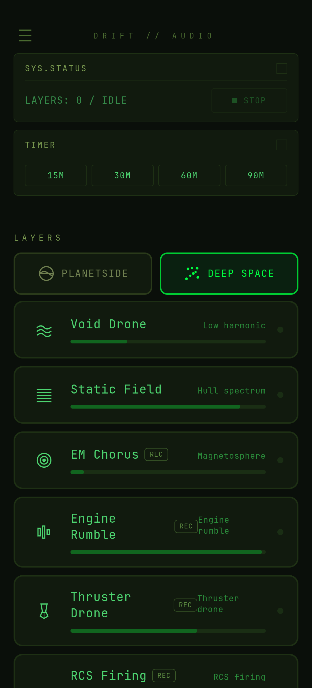
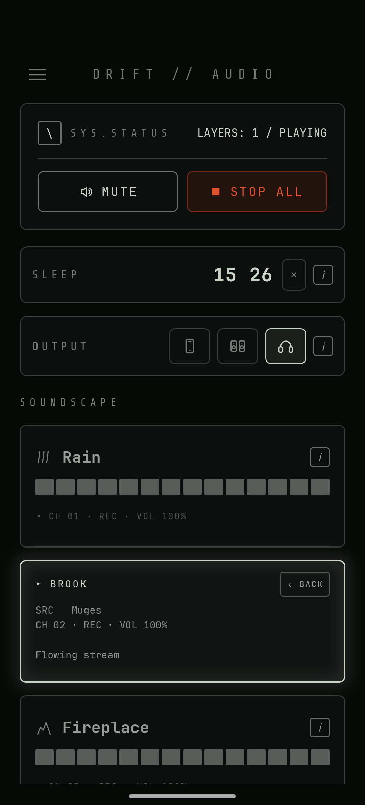
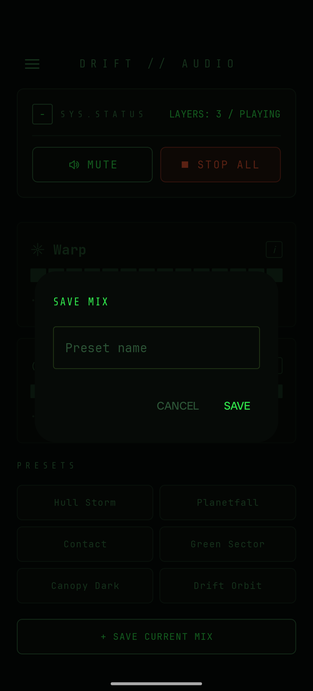

# Drift

[](LICENSE)
[](#build-requirements)

Drift is an ambient soundscape mixer for sleep and focus. Layer nature
recordings and synthesised drones, adjust each to taste, and let the
sleep timer fade things out. Everything runs offline. No ads, no
tracking, no account.

## Design

The interface borrows from cockpit instrument panels — monospaced
phosphor readouts on a dark background, with a twin multi-function
display for status and the sleep timer. The aesthetic is functional
and worn, built for the hours when most things have gone quiet.

Two sound categories sit behind tabs:

- **Planetside** — field recordings and synths of rain, fire, water,
  wind, birds, and crickets.
- **Deep Space** — synthesised drones and a handful of recorded
  engine/hull textures.

Layers from either category mix freely. Presets bundle useful
combinations (Monsoon Run, Hull Storm, Planetfall, Long Haul, and
others) for one-tap atmospheres.

## Features

- Mix any number of sound layers at independent volumes.
- Two categories: Planetside (nature) and Deep Space (synthesised
  ambience and recorded hull textures).
- Built-in presets for quick atmospheres.
- Sleep timer with 15, 30, 60, and 90 minute presets.
- Background playback with lock-screen media controls.
- Fully offline. No network access required after install.
- Open source under the MIT licence. Field recordings under Creative
  Commons, full attribution in [CREDITS.md](CREDITS.md).

## Screenshots





## Install

Drift is being prepared for distribution on
[F-Droid](https://f-droid.org). Until then, build from source using
the instructions below.

Drift is not distributed through Google Play, and has no plans to be.

## Build from source

### Requirements

- Node.js 20 LTS or newer
- Android Studio (Narwhal or newer)
- JDK 17
- Android SDK with `compileSdk 36`, `minSdk 24`
- Capacitor 8.3.0
- Android Gradle Plugin 9.1.1

Tested on a Nubia Pad Pro running Android 15.

### Build steps

```bash
git clone https://github.com/probably-oxy/drift-audio.git
cd drift-audio
npm install
npx cap sync android
```

Then open the `android/` folder in Android Studio and run on a
connected device or emulator.

During development, edit files in `www/` directly and re-run
`npx cap sync android` to copy changes into the Android project.

## Project structure

```
drift-audio/
├── www/                  The app itself (HTML + JS + CSS + assets)
│   ├── index.html
│   ├── app.js
│   ├── style.css
│   ├── fonts/            Bundled JetBrains Mono (OFL-1.1)
│   └── sounds/           Bundled audio segments
├── android/              Capacitor Android project
├── tools/                Development tools (not shipped with the app)
│   └── sound_lab.html    Synth design workbench
├── capacitor.config.json
├── LICENSE
└── CREDITS.md            Audio attribution
```

The app is a single-page web app wrapped with Capacitor. All audio
assets are bundled offline — no CDN, no external dependencies at
runtime.

## Development tools

The `tools/` directory contains a standalone browser-based workbench
(`sound_lab.html`) for designing synth patches. It is not part of the
shipping app. See [tools/README.md](tools/README.md).

## Privacy

Drift does not collect, transmit, or store any personal data. It does
not connect to the network. There are no ads, no analytics, no crash
reporting, and no account system.

The `INTERNET` permission is not declared in the Android manifest.

## Licence

Source code is under the [MIT licence](LICENSE).

Audio recordings and the bundled typeface are under their own licences:

- Field recordings: Creative Commons (CC0 and CC BY). Full attribution
  in [CREDITS.md](CREDITS.md).
- JetBrains Mono: [SIL Open Font License 1.1](www/fonts/OFL.txt).

## Credits

See [CREDITS.md](CREDITS.md) for audio recording attribution. In-app
credits are also available under the Credits menu.
